<div align="center">



<br/>

[<kbd> portfolio </kbd>](https://chamanvashishth.github.io/)
&nbsp;
[<kbd> linkedin </kbd>](https://www.linkedin.com/in/chaman-vashishth-b227a6387/)
&nbsp;
[<kbd> github </kbd>](https://github.com/chamanvashishth)
&nbsp;
[<kbd> x </kbd>](https://x.com/chmnvashishth)
&nbsp;
[<kbd> discord </kbd>](https://discord.gg/vashishthchaman)
&nbsp;
[<kbd> email </kbd>](mailto:chamanvashishth133@gmail.com)

</div>

---

<details>
<summary><code>▶ PS C:\Users\Chaman&gt; type about.txt</code></summary>

<br/>

Machine Learning-focused developer with hands-on experience in Python, neural networks, recommendation systems, explainable AI, and open-source software development.

I prefer understanding how systems work internally rather than treating libraries as black boxes.

</details>

<details>
<summary><code>▶ PS C:\Users\Chaman&gt; type stack.txt</code></summary>

<br/>

```text
Programming Languages
Python · C++ · JavaScript

Web Technologies
HTML5 · CSS3

Machine Learning & Data
NumPy · Pandas · SciPy · Scikit-learn

ML Concepts & Specializations
Neural Networks · Random Forest · Recommendation Systems
Collaborative Filtering · Matrix Factorization · ALS · SVD
SHAP · Explainable AI

ML Applications
Streamlit

Backend & APIs
Node.js · Express.js

Database
SQL

Developer Tools
Git · GitHub · Linux
```

</details>

<details>
<summary><code>▶ PS C:\Users\Chaman&gt; type currently.txt</code></summary>

<br/>

```text
> Building practical Machine Learning systems
> Contributing to open-source projects
> Strengthening software engineering and problem-solving skills
> Exploring ML, mathematics, neuroscience, and research
```

</details>

<details>
<summary><code>▶ PS C:\Users\Chaman&gt; type personal.txt</code></summary>

<br/>

```text
interests = [
    "Machine Learning",
    "Mathematics",
    "Neuroscience",
    "Research",
    "Open Source"
]
```

</details>
