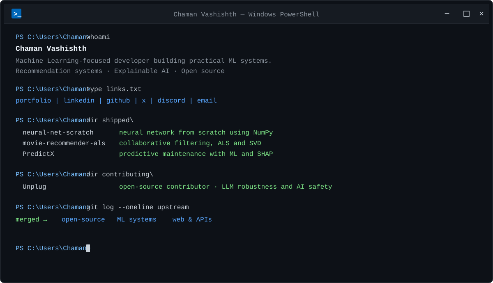

 

# Chaman Vashishth

**AI / ML Engineering · Neural Networks from First Principles · Applied Machine Learning**

I build AI systems I can **inspect, evaluate, and explain** — from the mathematics inside a model to the software around it.

 

[Portfolio](https://chamanvashishth.github.io/) ·
[LinkedIn](https://www.linkedin.com/in/chamanvashishth/) ·
[LeetCode](https://leetcode.com/u/vashishthchaman) ·
[X](https://x.com/chmnvashishth) ·
[Email](mailto:hellowvashishth)

---

## A little about my work

I'm an undergraduate studying **Internet of Things**, focused on machine learning, neural networks, and software systems that make intelligent behavior useful.

My approach is deliberately hands-on: implement core ideas where that helps build understanding, establish baselines before making claims, evaluate with relevant metrics, and document what is working versus what is still experimental. I'm especially interested in **local-first AI** and the engineering foundations behind models—not just the interface around them.

- **Build:** neural-network internals, applied ML workflows, recommendation systems, and AI tooling.
- **Study:** optimization, representation learning, model evaluation, and the mathematics behind learning systems.
- **Contribute:** open-source software, readable documentation, and reproducible experiments.

## Selected projects

These projects represent the questions I keep returning to: how models learn, how to evaluate them, and how to turn them into usable systems.

<table>
  <tr>
    <td width="50%" valign="top">
      <h3><a href="https://github.com/chamanvashishth/ARIA">ARIA — Autonomous Research & Intelligence Architecture</a></h3>
      Local-first AI · Neural systems
      
An independently built AI stack with a tensor engine, reverse-mode automatic differentiation, trainable layers, a tokenizer, and an experimental small Transformer language model. Designed to keep the model path inspectable rather than hide it behind a hosted API.

      
<strong>Working through:</strong> model internals, training/inference foundations, local runtime design.

    </td>
    <td width="50%" valign="top">
      <h3><a href="https://github.com/chamanvashishth/neural-net-scratch">Neural Network from Scratch</a></h3>
      Deep learning · Numerical computing
      
A NumPy-only MNIST classifier with dense layers, ReLU, batch normalization, inverted dropout, stable softmax-cross-entropy, manual backpropagation, and Adam optimization.

      
<strong>Working through:</strong> gradients, numerical stability, regularization, optimization.

    </td>
  </tr>
  <tr>
    <td width="50%" valign="top">
      <h3><a href="https://github.com/chamanvashishth/PredictX">PredictX — Predictive Maintenance</a></h3>
      Applied ML · Industrial IoT
      
An end-to-end predictive-maintenance workflow using sensor data, data-quality checks, model comparison, classification metrics, explainability, and a Streamlit dashboard for equipment-failure risk.

      
<strong>Working through:</strong> reproducible pipelines, model interpretation, operational context.

    </td>
    <td width="50%" valign="top">
      <h3><a href="https://github.com/chamanvashishth/movie-recommender-als">Movie Recommendation Engine</a></h3>
      Recommender systems · Matrix factorization
      
A collaborative-filtering system built around user/item biases, SVD initialization, and Alternating Least Squares, with a Streamlit interface and a cold-start fallback.

      
<strong>Working through:</strong> sparse data, latent factors, optimization, recommendation evaluation.

    </td>
  </tr>
  <tr>
    <td width="50%" valign="top">
      <h3><a href="https://github.com/chamanvashishth/AI-Resume-Classification-System">Resume Classification System</a></h3>
      NLP · Supervised learning
      
A baseline text-classification application using TF-IDF features and Logistic Regression to classify resume text into broad job categories.

      
<strong>Working through:</strong> text representation, baselines, classification workflows.

    </td>
    <td width="50%" valign="top">
      <h3><a href="https://github.com/chamanvashishth/GSoC-Org-Finder-">GSoC Organization Finder</a></h3>
      Developer tooling · Open source
      
A discovery tool for exploring open-source program organizations by domain and technology, with repository activity and contribution entry points to help narrow down where to participate.

      
<strong>Working through:</strong> API integration, developer experience, open-source discovery.

    </td>
  </tr>
</table>

[Explore all repositories →](https://github.com/chamanvashishth?tab=repositories)

## Experience

**AI & Machine Learning Intern — InAmigos Foundation**  
*August–September 2026*

Worked in the AI/ML domain, strengthening my understanding of applied machine-learning workflows and collaborative technical work.

## Technical toolkit

| Area | Tools and concepts |
|---|---|
| **Languages** | Python, C++, JavaScript, SQL |
| **Data & scientific computing** | NumPy, Pandas, SciPy |
| **Machine learning** | scikit-learn, TensorFlow, feature engineering, classification, model evaluation |
| **Deep learning foundations** | Backpropagation, gradient-based optimization, neural networks, numerical stability |
| **Applied ML** | Predictive maintenance, recommender systems, NLP, explainability |
| **Local AI** | Ollama, local model experimentation |
| **Applications** | Streamlit, Node.js, Express.js, HTML, CSS |
| **Workflow** | Git, GitHub, Linux, documentation, reproducible experiments |

## How I engineer

- **Understand the mechanism.** Implement core algorithms when it makes the underlying idea clearer.
- **Use evidence, not adjectives.** Prefer baselines, evaluation metrics, tests, and limitations over unsupported claims.
- **Treat experiments as engineering.** Keep data preparation, training, evaluation, and the application connected.
- **Make work inspectable.** Write documentation that helps another person understand the design and reproduce the result.
- **Be precise about maturity.** Separate implemented behavior from experimental capabilities and future plans.

## Current focus

- Developing **ARIA**, with emphasis on transparent neural-network and local-inference foundations.
- Deepening ML fundamentals through implementations and measured experiments.
- Preparing for sustained open-source contributions, including exploring potential **GSoC 2027** projects.
- Improving software quality through tests, clearer project documentation, and reproducible workflows.

## Education

**Bachelor of Vocation (B.Voc.) — Internet of Things**  
*Expected graduation: 2028*

My IoT background informs my interest in the boundary between machine learning and real systems: sensor data, predictive maintenance, edge constraints, and practical deployment.

## Let's connect

I'm interested in collaborating on **applied machine learning, local-first AI, neural-network fundamentals, and open-source developer tools**.

[Portfolio](https://chamanvashishth.github.io/) ·
[GitHub repositories](https://github.com/chamanvashishth?tab=repositories) ·
[LinkedIn](https://www.linkedin.com/in/chamanvashishth/) ·
[Email](mailto:chamanvashishth133@gmail.com)

